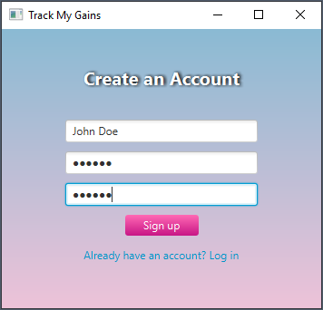
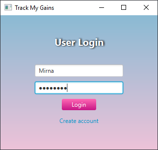
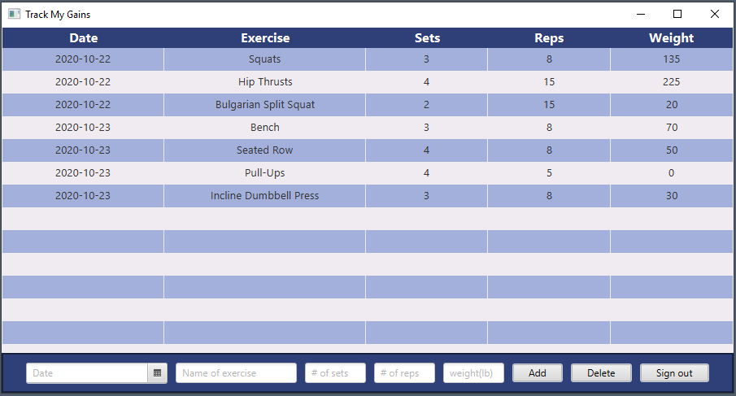

# Workout-Tracker
Author: Mirna Salem

Date: 11/06/2020

A JavaFx/Java application that uses MySQL database to store user and workout data locally. 

---

### Why is it important to track your workouts? 
Tracking your workouts allows you to plan, organize, and actualize your fitness goals.  

---

### What it looks like so far...

 

 

 

